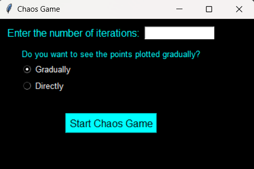
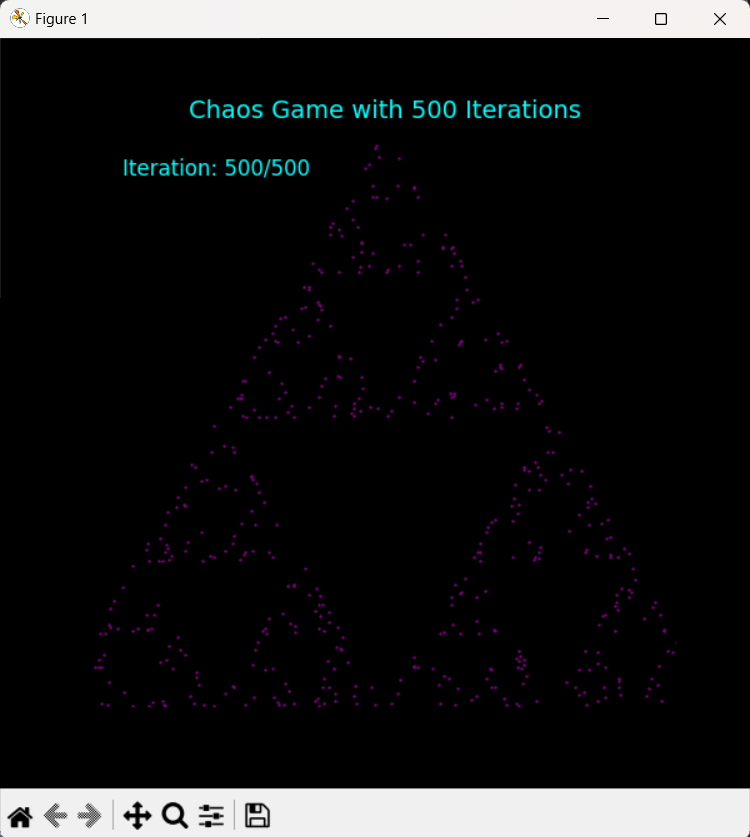

# ChaosGamePy

ChaosGamePy adalah proyek Python yang 
menerapkan konsep **Chaos Game**, 
sebuah metode untuk menghasilkan pola fraktal menggunakan iterasi acak. Proyek ini menggunakan GUI yang ramah pengguna untuk membiarkan pengguna menentukan jumlah iterasi dan memilih antara menampilkan hasil secara bertahap atau langsung.

## Fitur Utama

- **Interaktif**: Pengguna dapat memasukkan jumlah iterasi yang diinginkan untuk menghasilkan pola fraktal.
- **Pilihan Tampilan**: Pengguna dapat memilih untuk melihat titik-titik yang ditampilkan secara bertahap atau langsung.
- **Visualisasi Fraktal**: Menggunakan `matplotlib` untuk menampilkan hasil pola Chaos Game yang dihasilkan.

## Run the Project

1. Clone repositori:
   ```bash
   git clone <https://github.com/MuhammadPrasetyoN/ChaosGamePy.git>
   cd ChaosGamePy
   ```
   
2. Activate Virtual Environment
    ```bash
    # Untuk Windows
    venv\Scripts\activate

    # Untuk macOS/Linux
    source venv/bin/activate
   ```
   
3. Install the dependencies
    ```bash
   pip install -r requirements.txt
   ```

4. Run the script
    ```bash
   python play.py
   ```
   
5. Follow the GUI Instruction

## Example Result
- gui


- result


## Technologies Used
- Python: Programming language used.
- Tkinter: For creating the graphical user interface.
- Matplotlib: For visualizing fractal patterns.
- NumPy: For numerical data manipulation.


## License

This project is licensed under the [MIT License](LICENSE).